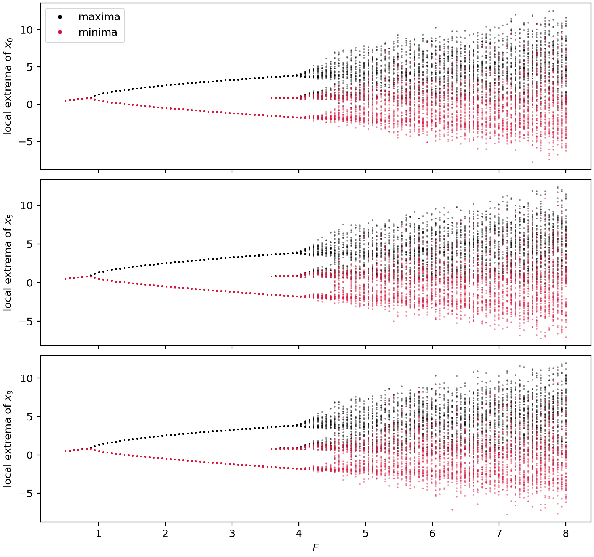

# `ntsa.bifurcation`

## At a glance

| Function | One-liner |
| --- | --- |
| `bifurcation_sweep(model, param, values, ...)` | Parameter sweep collecting observable extrema: one ensemble forecast — member `k` at `values[k]` — by default, or serial branch-following with `continuation=True`. |
| `plot_bifurcation(values, peaks, ...)` | Bifurcation diagram from `bifurcation_sweep` output. |

Produced by the module demo: `python -m ntsa.bifurcation --model lorenz96 --save-figs`.

## Full reference

::: ntsa.bifurcation
