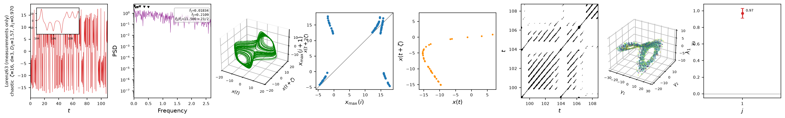

# `ntsa.data`

Data-driven front end: run the equation-free half of ntsa on a raw measured
series — no model equations required. `DataSeries` wraps a scalar record
$x(t)$ sampled at fixed `dt`, then embeds (`optimal_lag`, `false_nearest_neighbours`),
computes the correlation dimension $D_2$, estimates the leading Lyapunov
exponent from the data itself (`lyapunov.rosenstein_lyapunov`), classifies the
regime, and draws the same 8-panel diagnostic row as `ntsa.characterize`. Only
the methods that must re-integrate a model are bypassed: the full Lyapunov
spectrum and bifurcation sweeps.

```python
from ntsa.data import DataSeries

ds = DataSeries(x, dt=1e-3, label='hot-wire probe')
res = ds.analyze()            # zeta, dim, D2, regime, evidence, stats, MDS
ds.characterize('figs/probe.pdf')
```



*Lorenz63 characterized from its measurements (and state snapshots for the MDS
panel) only: $\lambda_1 = 0.97 \pm 0.06$ (true 0.906), classified chaotic.*

`analyze(lam1='auto')` (the default) runs the Rosenstein estimator, so measured
chaotic data reaches the `chaotic` label with no model at all; the estimator's
fit guards return `nan` on non-chaotic data rather than a spurious slope. Pass a
float for an external estimate, or `None` to skip — see the
[regime classification](../theory/classification.md) section.

## Full reference

::: ntsa.data
