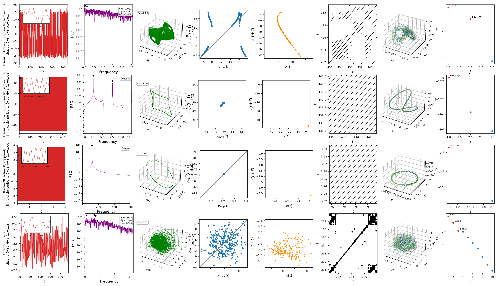

# ntsa

Characterizes the dynamical regime of a model from a single long trajectory:
delay embedding (optimal lag + false nearest neighbours), Lyapunov exponents, regime
classification (fixed point / limit cycle period-k / frequency-locked / quasiperiodic / chaotic),
and a per-case diagnostic figure — one row of 8 panels
[time series (red, with zoom inset) | PSD (purple, semilogy) | 3-D delay portrait (green,
with $D_\mathrm{KY}$ box) | first-return map of local maxima (blue) | plane-crossing Poincaré section
(orange) | recurrence plot (black/white) | 3-D MDS | Lyapunov spectrum] — plus Lyapunov-fit,
Lyapunov-spectrum and classical-MDS pages, all in one multi-page PDF.

Reference: Kantz & Schreiber, *Nonlinear Time Series Analysis* (2004).

*Demo output (`python -m ntsa.characterize`): Lorenz63 chaotic and period-1, Van der Pol, Lorenz96.*

## Ecosystem

- [`dynamodels`](https://github.com/andreanovoa/dynamodels) — the reference Model
  implementation (physical models used by the demos and tests).
- [romda](https://github.com/andreanovoa/real-time-bias-aware-DA) — real-time
  bias-aware data assimilation built on both packages.

## References

- Kantz & Schreiber (2004). *Nonlinear Time Series Analysis*, 2nd ed., Cambridge Univ. Press.
- Kennel, Brown & Abarbanel (1992). Determining embedding dimension for phase-space
  reconstruction using a geometrical construction. *Phys. Rev. A* 45, 3403.
- Benettin, Galgani, Giorgilli & Strelcyn (1980). Lyapunov characteristic exponents for smooth
  dynamical systems and for Hamiltonian systems. *Meccanica* 15, 9–30.
- Ginelli, Poggi, Turchi, Chaté, Livi & Politi (2007). Characterizing dynamics with covariant
  Lyapunov vectors. *Phys. Rev. Lett.* 99, 130601.
