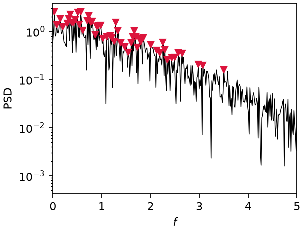
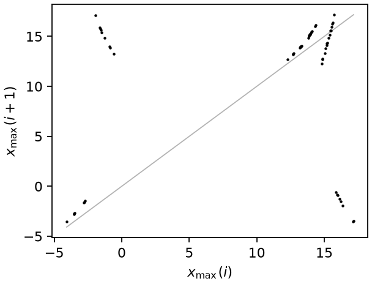
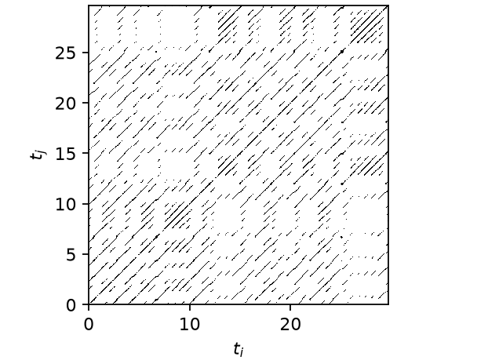
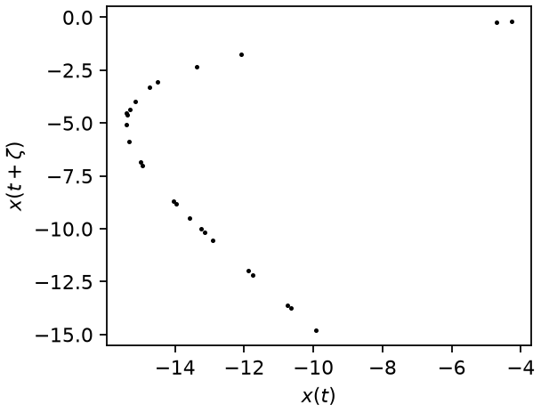
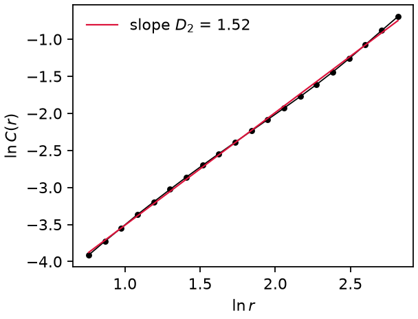

# Signal and attractor diagnostics

Qualitative fingerprints of the regime (PSD peaks, return map, recurrence,
Poincaré section) and the quantitative attractor dimension $D_2$.

## Power spectral density

`fun_PSD` uses the one-sided FFT amplitude spectrum,

$$
\mathrm{PSD}(f_k) = \frac{2}{N} \left| \sum_{j=0}^{N-1} x_j\,
e^{-2\pi i jk/N} \right| , \qquad f_k = \frac{k}{N\,\Delta t},\quad
k < N/2 .
$$

The classifier extracts the dominant peaks $f_1, f_2, \dots$ from it
(`find_peaks` with prominence thresholds) and tests their ratios for
rationality.

*PSD of chaotic Lorenz63: broadband, with the dominant peaks the classifier extracts (markers).*

## First-return map and peak clusters

Successive local maxima of the signal form the return map
$x_{\max}(i+1)$ vs $x_{\max}(i)$. A period-$k$ orbit produces $k$ tight
clusters; `count_peak_clusters` counts maxima levels that differ by more than
`tol` $\times$ the signal range. This check outranks a positive
perturbation-growth exponent in the classifier: $k$ tight maxima levels over a
long record are incompatible with chaos (see the
[decision tree](classification.md#decision-tree)).

*Return map of the Lorenz63 maxima: a continuum, not $k$ tight clusters — chaos.*

## Recurrence plot

$$
R_{ij} = \Theta\!\left( \varepsilon - \left\| \mathbf{Y}_i - \mathbf{Y}_j
\right\| \right),
$$

with $\Theta$ the Heaviside step and $\varepsilon$ set to 10% of the maximum
pairwise distance (retargeted to a fixed 10% recurrence rate when the density
degenerates). Periodic dynamics give unbroken diagonals; quasiperiodic
dynamics give diagonals of varying spacing; chaos gives short, broken
diagonals [Eckmann et al. 1987].

*Recurrence plot of chaotic Lorenz63: short, broken diagonals.*

## Poincaré section

`poincare_section` intersects the 3-D delay embedding with the plane
$x(t + 2\zeta) = \text{level}$ (median by default), keeping upward crossings.
Between bracketing samples $i$ and $i+1$ the crossing is linearly
interpolated,

$$
\mathbf{P} = \mathbf{Y}_i + w\,(\mathbf{Y}_{i+1} - \mathbf{Y}_i),
\qquad w = \frac{s_i}{s_i - s_{i+1}},
$$

where $s = Y_3 - \text{level}$ is the signed distance to the plane. A
limit cycle of period $k$ appears as $k$ points, a 2-torus as a closed loop,
chaos as a fractal scatter.

*Poincaré section of chaotic Lorenz63: a fractal scatter.*

## Correlation dimension (Grassberger–Procaccia)

The correlation sum over pairs of points on the attractor (or section),

$$
C(r) = \frac{2}{n(n-1)} \sum_{i<j} \Theta\!\left( r -
\left\| \mathbf{Y}_i - \mathbf{Y}_j \right\| \right)
\;\propto\; r^{D_2} \quad (r \to 0),
$$

gives $D_2$ as the slope of $\ln C$ vs $\ln r$ fitted between the 2nd and
50th distance percentiles [Grassberger & Procaccia 1983].
For a $k$-torus $D_2 \approx k$ on the attractor and $\approx k-1$ on its
Poincaré section — one of the three torus-dimension witnesses used in the
[worked example](../torus.md).

*Correlation-sum fit for the Lorenz63 delay embedding: fractal $D_2 = 1.5$.*

References are collected on the [theory overview](../theory.md).
