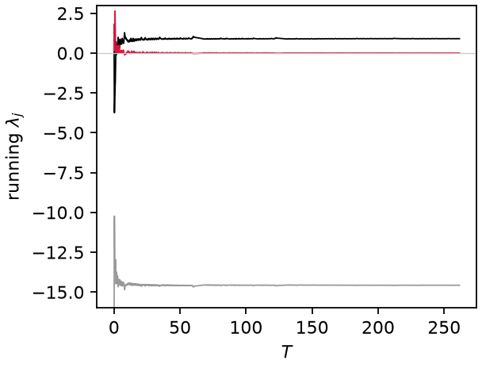
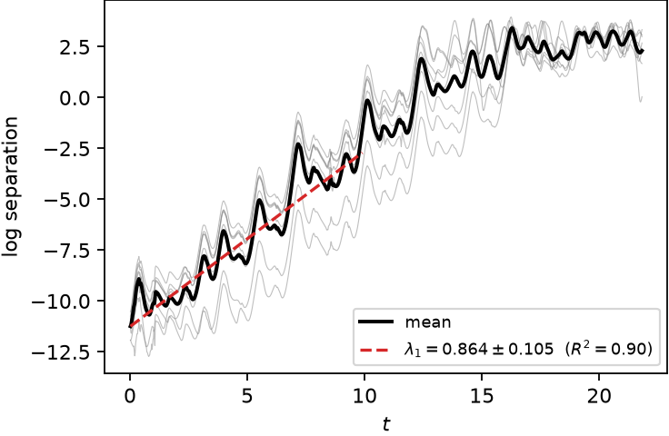
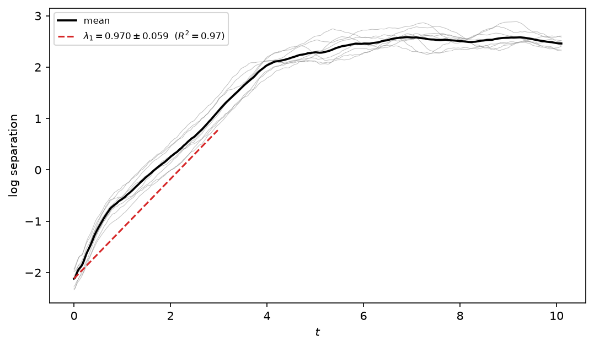

# Lyapunov exponents

Three routes, by what is available: the full spectrum needs the model's
right-hand side (and ideally its Jacobian); the perturbation-growth estimate
only needs a model that can be re-integrated; the Rosenstein estimate needs
nothing but the measured series. The Kaplan–Yorke dimension follows from the
spectrum.

## Full spectrum: Benettin QR

The full spectrum comes from evolving the state jointly with a tangent basis
$\Psi \in \mathbb{R}^{N_\phi \times n_\mathrm{exp}}$ under the variational
equation

$$
\dot{\psi} = f(\psi), \qquad
\dot{\Psi} = J(\psi)\,\Psi, \qquad
J = \frac{\partial f}{\partial \psi},
$$

(RK4, analytic $J$ for Lorenz63/96, finite differences otherwise), with QR
re-orthonormalization $\Psi = QR$ every $N_\mathrm{gs}$ steps. The exponents
are the time-averaged log growth of the diagonal of $R$ [Benettin et al. 1980]:

$$
\lambda_j = \lim_{T \to \infty} \frac{1}{T} \sum_{m} \ln R_{jj}^{(m)} .
$$

**Convergence control.** The neutral (along-flow) exponent decays to zero only
as $\mathcal{O}(1/T)$, so the horizon is extended (up to `t_max`) until the
halving test

$$
\left| \lambda_j(T) - \lambda_j(T/2) \right| <
\max\!\left( \text{atol},\ \text{rtol} \cdot |\lambda_j| \right)
$$

passes at two consecutive checks (one can be a phase coincidence).

*Running exponents of Lorenz63 converging to $[0.90,\ 0.00,\ -14.6]$.*

## Leading exponent from perturbation growth

Without any Jacobian (so it also works for discrete maps), `leading_lyapunov`
evolves an ensemble of perturbed copies $\psi + \delta_0 \mathbf{e}$ and fits
the linear region of the mean log separation,

$$
\lambda_1 \approx \frac{d}{dt} \left\langle \ln \left\|
\psi_\mathrm{pert}(t) - \psi_\mathrm{ref}(t) \right\| \right\rangle ,
$$

between the transient and the saturation plateau (automatic window; fit
rejected if $R^2 < 0.5$).

**Saturation guard.** On a stable orbit, non-normal transient amplification
can produce a large positive slope even though there is no chaos
(thermoacoustic systems read $\lambda_1 \sim 200$ this way). The fit is
rejected when the separation saturates far below the attractor diameter while
the tail has stopped growing:

$$
\text{sat} < 0.05 \cdot \mathrm{diam}
\quad \text{and} \quad
\text{tail slope} < 0.1\,\lambda_1 .
$$

*Perturbation-growth fit on Lorenz63: $\lambda_1 = 0.86 \pm 0.11$ from the linear region of the mean log separation.*

## Data-only: Rosenstein estimator

When only a measured series is available, `rosenstein_lyapunov` applies the same
idea to the delay embedding [Rosenstein et al. 1993]: each reference point
$\mathbf{y}_i$ is paired with its nearest neighbour $\mathbf{y}_j$ at least one
Theiler window $w$ away in time ($|i - j| > w$, with $w$ the mean inter-maximum
spacing, so pairs sample different orbits rather than adjacent samples of the
same one), and the mean log divergence

$$
S(k) = \left\langle \ln \left\| \mathbf{y}_{i+k} - \mathbf{y}_{j+k} \right\|
\right\rangle_{(i,j)}
$$

is fitted over its linear window with the same machinery — and the same $R^2$
and growth-range guards — as above, so periodic or noise-bound data returns nan
rather than a spurious slope. Pairs are averaged in 8 blocks whose slope spread
gives the quoted uncertainty. This is what `DataSeries.analyze` runs by default,
letting measured data reach the `chaotic` label with no model at all:

*Lorenz63 from measurements only: $\lambda_1 = 0.97 \pm 0.06$ against the true 0.906.*

## Kaplan–Yorke dimension

With the exponents sorted $\lambda_1 \geq \lambda_2 \geq \dots$ and $j$ the
largest index with $\sum_{i=1}^{j} \lambda_i \geq 0$,

$$
D_\mathrm{KY} = j + \frac{\sum_{i=1}^{j} \lambda_i}{\left| \lambda_{j+1}
\right|} ,
$$

conjectured equal to the information dimension [Kaplan & Yorke 1979]. Shown as
a text box on the delay-portrait panel.

References are collected on the [theory overview](../theory.md).
