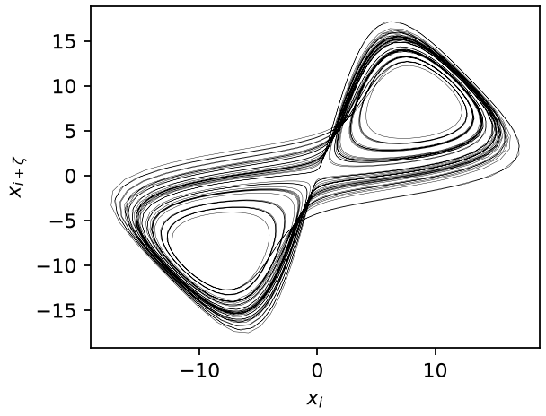
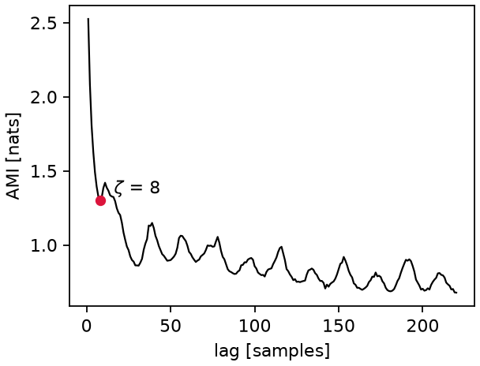
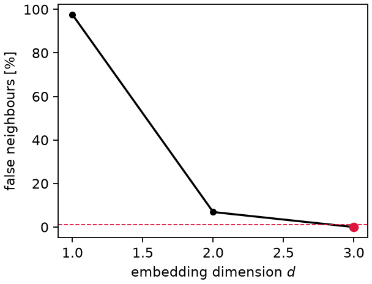
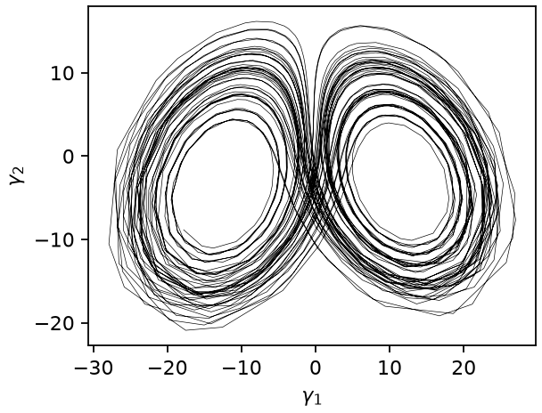

# Phase-space reconstruction

How coordinates for the attractor are obtained — from a scalar record (delay
embedding, with its two free parameters) or from the full state trajectory (MDS).

## Delay embedding (Takens)

The attractor is reconstructed from the scalar record by the delay map

$$
\mathbf{Y}_i = \left( x_i,\ x_{i+\zeta},\ \dots,\ x_{i+(d-1)\zeta} \right)
\in \mathbb{R}^d ,
$$

which is an embedding (diffeomorphic to the true attractor) for
$d > 2\,d_A$ with $d_A$ the attractor's box-counting dimension [Takens 1981].
`delay_embed(x, dim, lag)` builds $\mathbf{Y}$; the two free parameters are
chosen as follows.

*Two delay coordinates of chaotic Lorenz63 ($\zeta = 8$ samples).*

## Optimal lag: average mutual information

The AMI between the signal and its $\zeta$-shifted copy,

$$
I(\zeta) = \sum_{k,l} p_{kl}(\zeta)\,
\ln \frac{p_{kl}(\zeta)}{p_k\, p_l},
$$

is estimated on a histogram ($p_k$: marginal bin probabilities, $p_{kl}$:
joint probabilities of $x_i$ falling in bin $k$ and $x_{i+\zeta}$ in bin $l$).
`optimal_lag` returns the **first local minimum** of $I(\zeta)$ — the classic
compromise between independence (large $I$ drop) and staying on the same
attractor fold [Fraser & Swinney 1986].

*AMI of the Lorenz63 $x$ record; the first local minimum sets $\zeta = 8$.*

## Embedding dimension: false nearest neighbours

For each point $\mathbf{Y}_i$ in dimension $d$ with nearest neighbour
$\mathbf{Y}_{n(i)}$ at distance $R_d(i)$, the neighbour is declared **false** if
unfolding to $d+1$ stretches it too much [Kennel et al. 1992]:

$$
\frac{\left| x_{i+d\zeta} - x_{n(i)+d\zeta} \right|}{R_d(i)} > R_\mathrm{tol}
\quad \text{or} \quad
\frac{R_{d+1}(i)}{\sigma_x} > A_\mathrm{tol},
$$

with $R_\mathrm{tol} = 10$, $A_\mathrm{tol} = 2$ and $\sigma_x$ the signal's
standard deviation. `false_nearest_neighbours` returns the smallest $d$ whose
false-neighbour fraction drops below 1%.

*False-neighbour fraction for Lorenz63: below the 1% threshold (dashed) at $d = 3$.*

## Classical multidimensional scaling

From the pairwise distance matrix $D_{ij}$ of the (subsampled) state
trajectory, the Gram matrix is recovered by double centring,

$$
B = -\tfrac{1}{2}\, H\, D^{(2)}\, H, \qquad
H = I - \tfrac{1}{n}\mathbf{1}\mathbf{1}^{\!\top},
$$

where $D^{(2)}$ holds squared distances. The embedding coordinates are
$\gamma_j = \sqrt{\mu_j}\, v_j$ from the top eigenpairs $(\mu_j, v_j)$ of $B$
— a distance-preserving 3-D view of the attractor that requires no choice of
observable.

*First two MDS coordinates $\gamma_1, \gamma_2$ of the Lorenz63 state trajectory.*

References are collected on the [theory overview](../theory.md).
