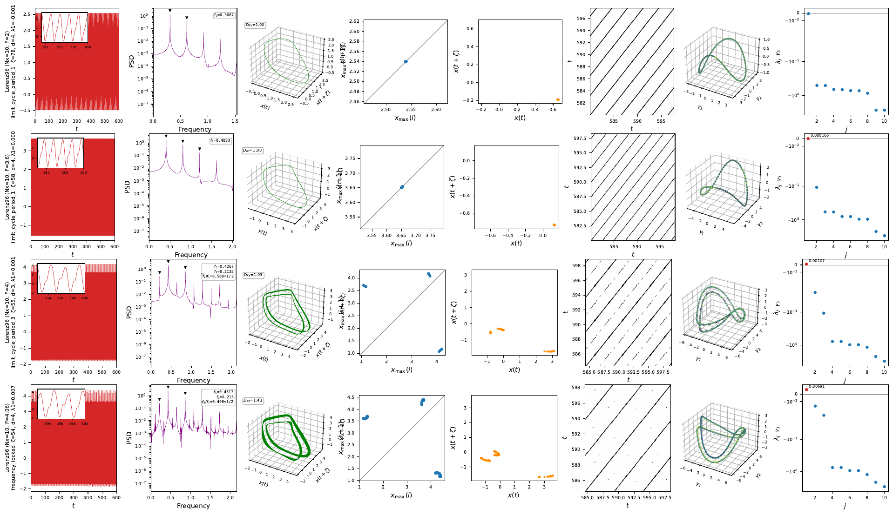
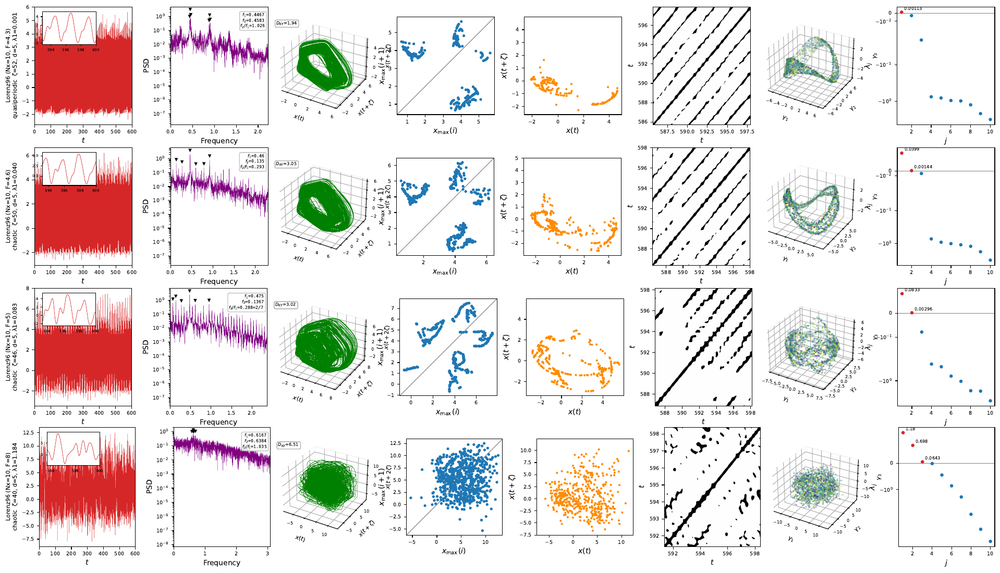

# Worked example: torus dimensions along a Ruelle–Takens–Newhouse route

The torus dimension T^k is read off three independent witnesses: the number of
**neutral Lyapunov exponents** (k zeros: limit cycle 1, 2-torus 2, 3-torus 3 — chaos has
a positive one instead), the **correlation dimension** $D_2$ of the attractor ($\approx$ k, fractal
for chaos) and of the plane-crossing **Poincaré section** ($\approx$ k-1: dots $\to$ loop $\to$ band).
Measured on Lorenz-96 (Nx=10), the route is textbook RTN, with locking windows
interleaving near the breakdown and no stable 3-torus (as RTN predicts — $T^3$ is
generically unstable and the attractor turns strange directly):

| F | $\lambda$ signature ($n_0$ = neutrals) | $D_2$ state / section | regime |
| --- | --- | --- | --- |
| 2–3.95 | one zero | 1.05 / — | limit cycle ($T^1$) |
| 4.0–4.06 | one zero | — | locked windows (periodic on the torus) |
| 4.2–4.4 | **two zeros** | 1.8 / 0.9 | quasiperiodic ($T^2$) |
| 4.45 | $\lambda_1 = 0.016$, $n_0$=2 | 2.0 / 1.0 | first chaos, interleaved with... |
| 4.5–4.55 | two zeros | 2.1–2.2 / 1.0 | ...re-locked/QP windows (Arnold tongues) |
| 4.6 | $\lambda_1 = 0.039$ (converged) | 2.15 / 1.02 | chaotic **wrinkled torus** — section still loop-like |
| 5 | $\lambda_1 = 0.07$ (plateau, $\lambda_1 T$ grows) | 2.9 / 1.1 | chaos on a thickened torus remnant |
| 8 | 3 positive exponents | 4.8 / 1.8 | developed chaos ($D_\mathrm{KY} \approx 6.5$) |

This is why F=4.6 and F=5 "look QP": the strange attractor inherits the torus geometry
($D_2$ barely above 2, section barely above a loop) while the dynamics on it are already
exponentially divergent — the spectrum, not the geometry, makes the call.

## The route in the 8-panel diagnostics

Generated with `python -m ntsa.characterize --model lorenz96 --param F --values ...`
(Nx = 10). On the torus side of the route, the delay portrait fills a surface, the
Poincaré section closes into a loop, and the spectrum shows two neutral exponents;
past breakdown the section stays loop-like long after $\lambda_1$ turns positive.

**F = 2 $\to$ 4.06 — limit cycles and locking.** Period-1 orbits ($D_\mathrm{KY}$ = 1, single
return-map cluster), then a period-3 window at F = 4 and a locked state at
F = 4.06 ($f_2/f_1 \approx$ 1/2, $D_\mathrm{KY}$ = 1.43):

**F = 4.3 $\to$ 8 — torus, breakdown, developed chaos.** The 2-torus at F = 4.3
(quasiperiodic, $D_\mathrm{KY}$ = 1.94, loop-shaped section), the wrinkled-torus chaos at
F = 4.6 ($\lambda_1$ = 0.040) and F = 5 ($\lambda_1$ = 0.083) where the section still looks like a
thickened loop, and developed chaos at F = 8 (three positive exponents,
$D_\mathrm{KY}$ = 6.51):

